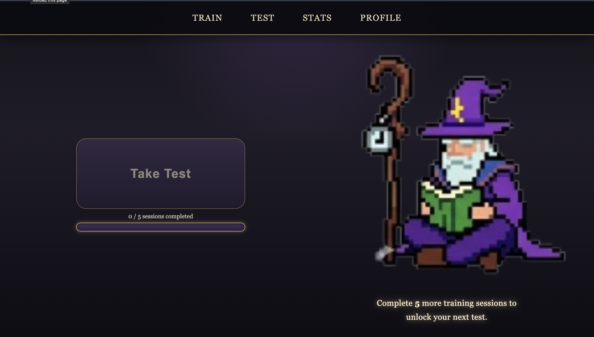
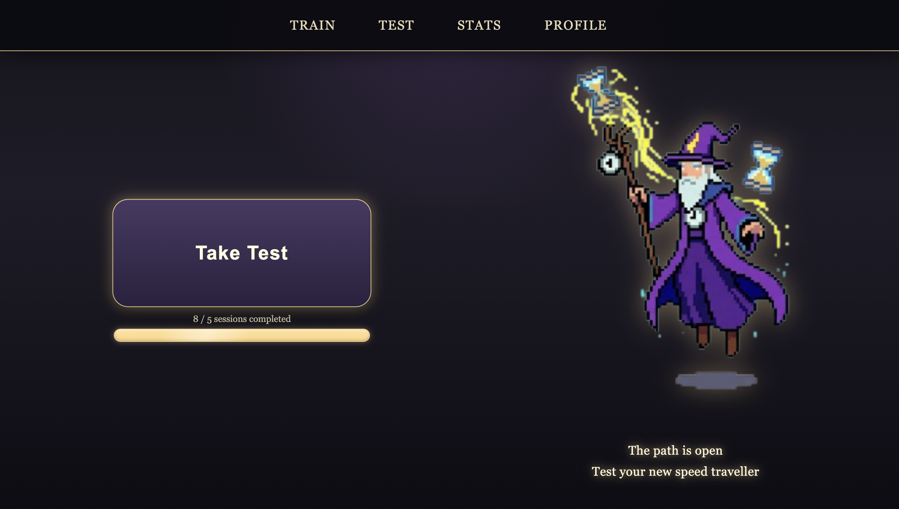
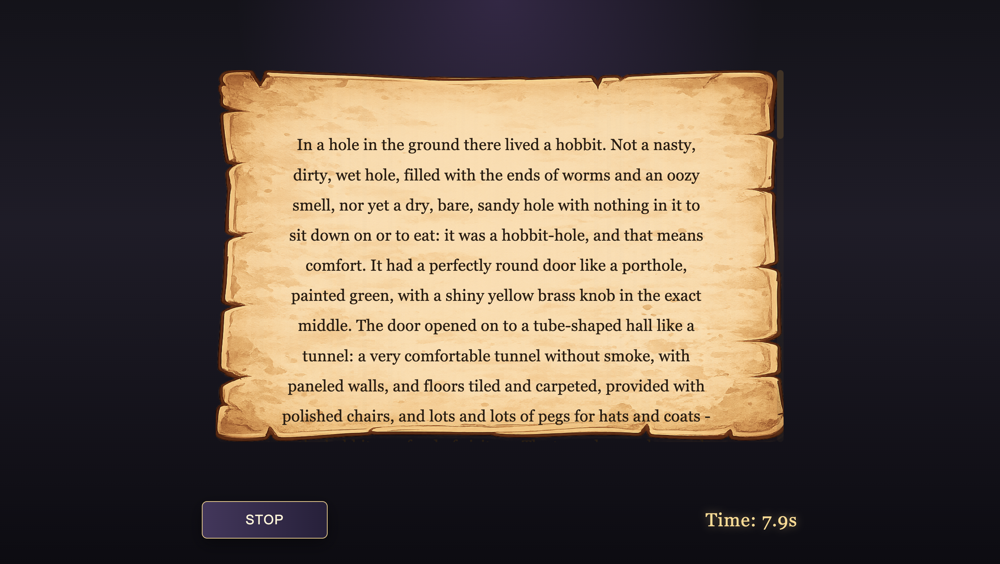
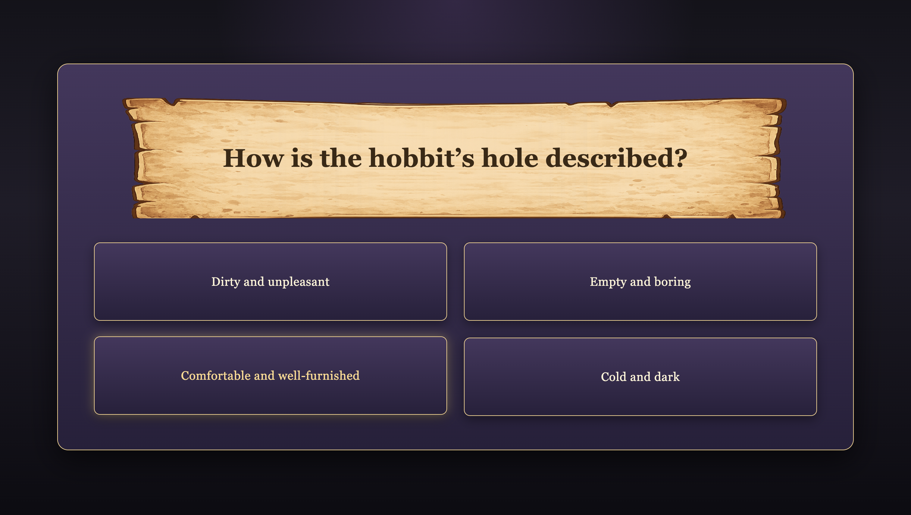
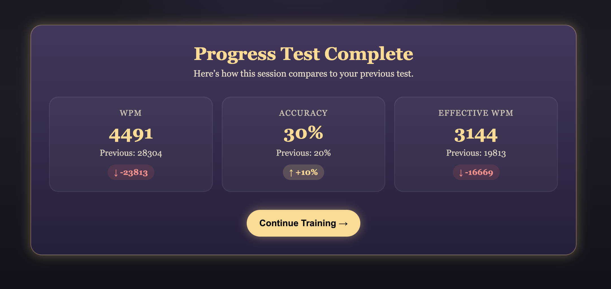

# Read. For Speed

Read. For Speed is a full-stack web application that helps users improve reading speed while maintaining comprehension. It combines RSVP-based reading drills, timed comprehension tests, and progress tracking to create a measurable training system.

## Features

- RSVP reader that uses user's effective words per minute
- Baseline test to measure initial reading speed and comprehension
- Progress tests unlocked after training sessions
- Multiple-choice comprehension questions
- User performance metrics: WPM, accuracy, and effective WPM
- Secure authentication and persistent user profiles

## Live Demo

Try it here: https://read-for-speed.vercel.app

## Screenshots

### RSVP Training

Users train with a focused RSVP reader that displays text at a controlled pace.

### Test Open and Closed

Users begin a timed reading test to measure baseline or progress performance.

### Reading Test

The reading passage is presented in a distraction-free interface while reading time is tracked.

### Comprehension Questions

Users answer multiple-choice questions to validate comprehension.

### Test Results

Results show reading speed, comprehension accuracy, and effective WPM.

## Tech Stack

**Frontend:** React, Vite, TypeScript, CSS  
**Backend:** Node.js, Express, TypeScript  
**Database/Auth:** Supabase, PostgreSQL  
**Testing:** Vitest, Supertest

## Architecture Highlights

- JWT-based authentication using Supabase
- Protected API routes with Express middleware
- Persistent user profiles and progress data
- Baseline and progress testing system
- Training eligibility logic based on completed sessions
- Atomic database updates using Supabase RPC functions

## API Overview

GET    /api/baseline/test
GET    /api/baseline/questions/:baselineTestId
POST   /api/baseline/submit

POST   /api/rsvp/results

GET    /api/progress/fetch
GET    /api/stats/heatmap

## Core Metrics

WPM = wordCount / (readingTimeSeconds / 60)

accuracy = correctAnswers / totalQuestions

effectiveWPM = WPM × accuracy

## Future Improvements

- Additional training methods
  - Speed drills (in progress)
  - Chunked RSVP reading (in progress)
- Expand testing database
